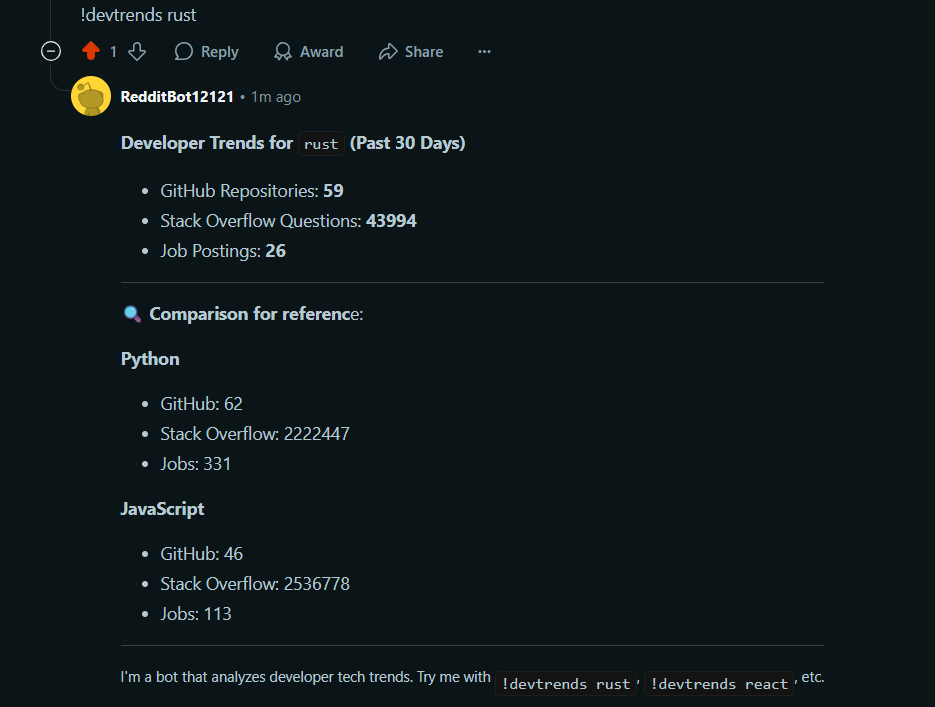

#  Tech Trends Reddit Bot

A Reddit bot that detects developer and market interest in programming technologies based on **GitHub activity**, **Stack Overflow mentions**, **job postings**, and **Google Trends**, then replies with a summary and visual graph. Ideal for spotting tech trends like the rise of Rust, Python, or TypeScript.

---

##  Features

-  Aggregates data from:
  - **GitHub repositories**
  - **Stack Overflow tags**
  - **Job posting frequency**
  - **Google Trends** (12-month smoothed graph)
-  Replies to Reddit comments with a keyword trigger (e.g. `!devtrends rust`)
-  Uploads trend graph to **ImgBB** and embeds it in the reply
-  Modularized, easy-to-extend Python codebase

---

##  Setup

### 1. Clone the repository

```bash
git clone https://github.com/umer901/RedditDevBot
```

### 2. Create and activate a virtual environment (optional but recommended)

```bash
python -m venv venv
source venv/bin/activate  # or venv\Scripts\activate on Windows
```

### 3. Install dependencies

```bash
pip install -r requirements.txt
```

### 4. Create a `.env` file

```
# Reddit API
REDDIT_CLIENT_ID=your_client_id
REDDIT_CLIENT_SECRET=your_client_secret
REDDIT_USERNAME=your_reddit_username
REDDIT_PASSWORD=your_reddit_password
REDDIT_USER_AGENT=TechTrendBot by u/your_reddit_username

# Imgbb API
IMGBB_API_KEY=your_imgbb_api_key
```

---

## 🚀 Running the Bot

Make sure your `.env` file is set up, then run:

```bash
python reddit.py
```

The bot will listen for Reddit comments that start with:

```
!devtrends <technology>
```

Example:

```
!devtrends rust
```

Here is a sample response (excluding the graph)



---

##  Project Structure

```
tech-trends-bot/
├── reddit.py             # Main bot script
├── main.py             # Runs secondary functions
├── github.py             # GitHub data fetcher
├── stackoverflow.py      # Stack Overflow tag scraper
├── jobs.py               # Job postings search
├── trends.py             # Google Trends + graphing
├── utils.py              # Image upload and helpers
├── requirements.txt
└── README.md
```

---
